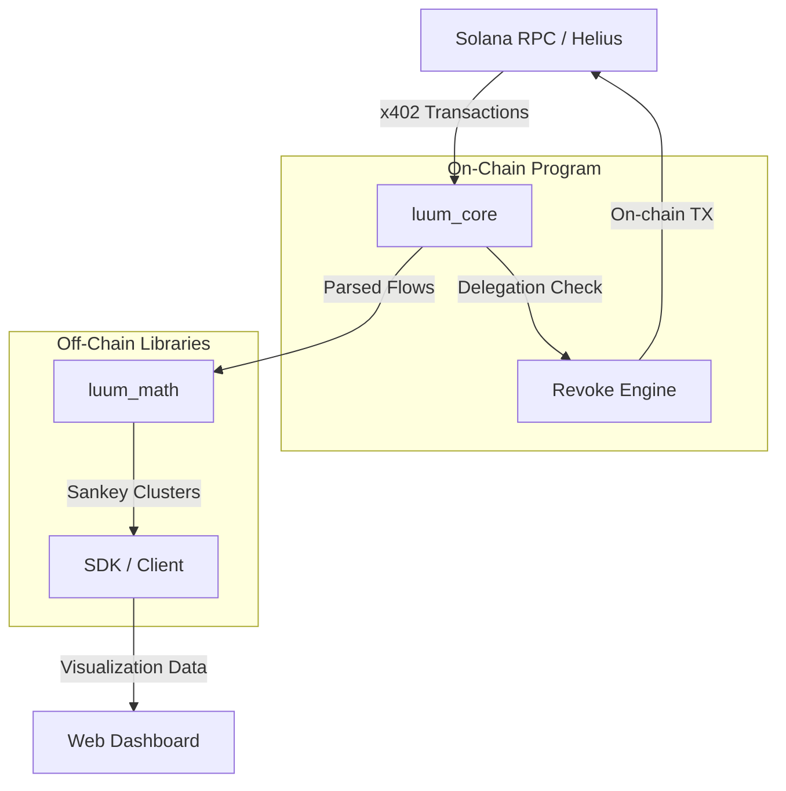

<p align="center">
  
</p>

<p align="center">
  <a href="https://x.com/luumdotli">
    
  </a>
  <a href="https://luum.li">
    
  </a>
  <a href="https://github.com/luum-labs/luum/actions">
    
  </a>
  
</p>

<h3 align="center">High-frequency x402 micro-payment analysis engine for Solana AI agents</h3>

---

## Architecture



## Features

| Feature | Description | Module |
|---------|-------------|--------|
| Micro-transaction parsing | Decode x402 USDC transfers from Solana agent wallets | `luum_core` |
| Receiver clustering | Group payment destinations by frequency and amount | `luum_math` |
| Sankey flow generation | Build weighted directed graphs for visualization | `luum_math` |
| Delegation revoke | Sever leaking spending authorities on-chain | `luum_core` |
| CLI analysis | Terminal-based wallet analysis and reporting | `cli` |
| TypeScript SDK | Programmatic access to parsing and clustering | `sdk` |

## Installation

```bash
git clone https://github.com/luum-labs/luum.git
cd luum
```

### Build the on-chain program

```bash
anchor build
```

### Build the CLI

```bash
cargo build --release -p cli
```

### Install SDK dependencies

```bash
cd sdk && npm install
```

## Usage

### Analyze an agent wallet via CLI

```bash
./target/release/cli analyze --address <WALLET_ADDRESS> --days 7
```

### Use the TypeScript SDK

```typescript
import { LuumClient } from "./luum-sdk";

const client = new LuumClient("https://api.helius.xyz/v0");
const flows = await client.analyzeWallet("AgentWa11et...", { days: 7 });
console.log(flows.sankey);
```

## Project Structure

```
luum/
  programs/luum_core/   Anchor program (on-chain)
  libs/luum_math/       Clustering and Sankey engine
  cli/                            Command-line analysis tool
  sdk/                            TypeScript client library
  tests/                          Integration tests
```

## License

MIT
<!-- docs --> v70
